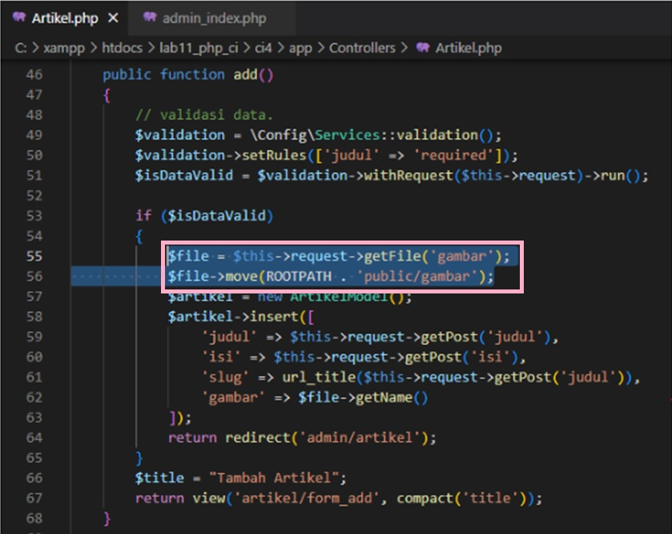
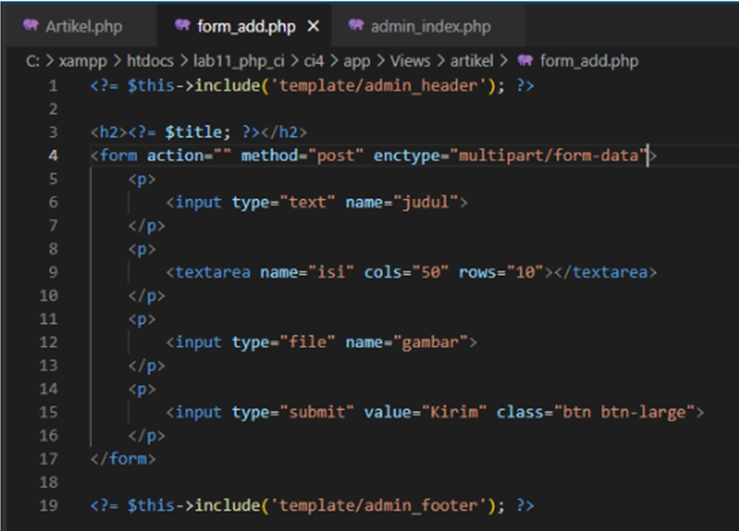

# Lab11Web
## Praktikum 11: PHP Framework (Codeigniter)
Buat folder baru lab11_php_ci lalu Jalankan XAMPP Ubah file php.ini seperti berikut :

.png)

Pada bagian extention, hilangkan tanda ; (titik koma) pada ekstensi yang akan 
diaktifkan. Kemudian simpan kembali filenya dan restart Apache web server

.png)

## Instalasi Codeigniter 4
Untuk melakukan instalasi Codeigniter 4 dapat dilakukan dengan dua cara, yaitu cara 
manual dan menggunakan composer. Pada praktikum ini kita menggunakan cara 
manual.

Unduh Codeigniter dari website https://codeigniter.com/download
• Extrak file zip Codeigniter ke direktori htdocs/lab11_ci.
• Ubah nama direktory framework-4.x.xx menjadi ci4.
• Buka browser dengan alamat http://localhost/lab11_ci/ci4/public/

.png)

## Buka cmd pada XAMPP Shell lalu buka php spark, untuk menjalankan server ketik "php spark serve" :

.png)

## Mengaktifkan Mode Debugging
Codeigniter 4 menyediakan fitur debugging untuk memudahkan developer untuk 
mengetahui pesan error apabila terjadi kesalahan dalam membuat kode program.

Secara default fitur ini belum aktif. Ketika terjadi error pada aplikasi akan ditampilkan 
pesan kesalahan seperti berikut.

.png)

## Mengaktifkan mode Debugging dengan mengubah file .env menjadi = development, seperti berikut :

.png)

Untuk mencoba Error hilangkan tanda ; (titik koma) pada Home.php, seperti berikut :

.png)

Contoh error/kesalahan akan ditampilkan secara detail

.png)

## Mengarahkan router pada controller, kemudian Membuat Route Baru Tambahkan kode berikut pada Route.php :

.png)

Cek pada CMD dengan memasukan "php spark routes", Akses route yang telah dibuat dengan http://localhost:8080/about, hasilnya :

.png)

Ketika diakses akan mucul tampilan error 404 file not found, itu artinya file/page 
tersebut tidak ada. Untuk dapat mengakses halaman tersebut, harus dibuat terlebih 
dahulu Contoller yang sesuai dengan routing yang dibuat yaitu Contoller Page.

.png)

## Membuat Controller
Selanjutnya adalah membuat Controller Page. Buat file baru dengan nama page.php 
pada direktori Controller kemudian isi kodenya seperti berikut.

.png)

Hasilnya :

.png)

## Auto Routing
Mengaktifkan AutoRouting dengan men set nilai true/false, jika true maka fungsi akan aktif

.png)

Tambahkan method baru pada Controller Page seperti berikut untuk page Term of Services

.png)

Akses http://localhost:8080/page/tos hasilnya :

.png)

## Membuat View
Selanjutnya adalam membuat view untuk tampilan web agar lebih menarik. Buat file 
baru dengan nama about.php pada direktori view (app/view/about.php) kemudian isi 
kodenya seperti berikut.

.png)

ubah method about pada class Controller Page menjadi seperti berikut:

.png)

Kemudian lakukan refresh pada halaman tersebut.
hasilnya

.png)

## Membuat Layout Web dengan CSS
Pada dasarnya layout web dengan css dapat diimplamentasikan dengan mudah pada 
codeigniter. Yang perlu diketahui adalah, pada Codeigniter 4 file yang menyimpan asset 
css dan javascript terletak pada direktori public. 

Buat file css pada direktori public dengan nama style.css

.png)

Kemudian buat folder template pada direktori view kemudian buat file header.php dan footer.php

header.php

.png)

footer.php

.png)

Kemudian ubah file app/view/about.php seperti berikut

.png)

Selanjutnya refresh tampilan pada alamat http://localhost:8080/about

.png)

## Pertanyaan dan Tugas

Lengkapi kode program untuk menu lainnya yang ada pada Controller Page, sehingga semua link pada navigasi header dapat menampilkan tampilan dengan layout yang sama

Tambahkan kode berikut di dalam Routes.php

.png)

edit page control pada page.php

.png)

Buat file artikel.php dan contact.php pada direktori app/view/.....

.png)

.png)

saat kita membuka halaman artikel dan kontak maka tampilan akan menuju page artikel,about dan kontak 

artikel

.png)

kontak

.png)

about

.png)

# Praktikum 12: Framework Lanjutan (CRUD)
## Membuat Database
CREATE DATABASE lab_ci4;
Membuat Tabel

seperti gambar berikut

.png)

Jalankan MySQL pada program XAMPP berjalan dan buat database seperti berikut :

.png)

## Konfigurasi koneksi database
Mengkonfigurasi koneksi database pada file .env seperti berikut :

.png)

## Membuat Model
Membuat file Model pada direktori app/Models dengan nama ArtikelModel.php seperti berikut :

.png)

## Membuat Controller
Membuat file Controller baru dengan nama Artikel.php pada direktori app/Controllers. seperti berikut :

.png)

## Membuat View
Membuat file Views baru dengan nama artikel pada direktori app/views, kemudian buat filebaru dengan nama index.php, seperti berikut 

.png)

Jalankan server dan akses link : http://localhost:8080/artikel

hasilnya

.png)

Masukan data berikut pada database :

.png)

Refresh kembali browser, sehingga akan ditampilkan hasilnya.

.png)

## Membuat Tampilan Detail Artikel
Menambahkan Detail pada Artikel.php seperti berikut :

.png)

## Membuat View Detail
Membuat file baru baru untuk halaman detail dengan nama app/views/artikel/detail.php. seperti berikut :

.png)

Tambahkan rute baru pada Routes.php :

.png)

Tampilan Artikel setelah di Klik :

.png)

## Membuat Menu Admin
Buat method baru pada Controller Artikel dengan nama admin_index() :

.png)

Buat file baru dengan nama admin_index.php pada folder artikel :

.png)

.png)

Tambahkan Routing baru pada Routes.php seperti berikut :

.png)

Akses menu admin dengan url http://localhost:8080/admin/artikel :

hasilnya

.png)

## Menambah Data Artikel
Tambahkan fungsi/method baru pada Controller Artikel dengan nama add() :

.png)

Lalu buat file baru dengan nama form_add.php pada folder artikel :

.png)

tampilan saat klik artikel :

.png)

## Mengubah Data artikel
Tambahkan fungsi/method baru pada Controller Artikel dengan nama edit() :

.png)

Lalu buat file baru dengan nama edit_add.php pada folder artikel :

.png)

Tampilan saat mengubah artikel :

.png)

## Menghapus Data
Tambahkan fungsi/method baru pada Controller Artikel dengan nama delete().

.png)

## Pertanyaan dan Tugas
Selesaikan programnya sesuai Langkah-langkah yang ada. Anda boleh melakukan 
improvisasi

jawab

bismillahirrahmanirrahim

# Praktikum 13: Framework Lanjutan (Modul Login)
## Membuat Tabel User
Membuat Tabel: User Login

.png)

.png)

## Membuat Model User
Selanjutnya adalah membuat Model untuk memproses data Login. Buat file baru pada direktori app/Models dengan nama UserModel.php

.png)

## Membuat Controller User
Buat Controller baru dengan nama User.php pada direktori app/Controllers. kemudian tambahkan fungsi index() sebagai berikut :

.png)

.png)

## Membuat View Login
Buat direktori baru dengan nama user pada direktori app/views, kemudian buat file baru dengan nama login.php. Dengan kode berikut

.png)

## Membuat Database Seeder
Buka CLI dan masukan kode "php spark make:seeder UserSeeder", Hasilnya :

.png)

Lalu buka file UserSeeder.php yang berada di lokasi direktori /app/Database/Seeds/UserSeeder.php kemudian isi dengan kode berikut

.png)

Selanjutnya buka kembali CLI dan ketik perintah "php spark db:seed UserSeeder" , Hasilnya :

.png)

## Menambahkan Auth Filter
Selanjutnya membuat filer untuk halaman admin. Buat file baru dengan nama Auth.php pada direktori app/Filters. berikut :

.png)

Selanjutnya buka file app/Config/Filters.php tambahkan kode berikut:

.png)

Selanjutnya buka file app/Config/Routes.php dan sesuaikan kode berikut :

.png)

## Percobaan Akses Menu Admin
Percobaan menu akses LOGIN

Buka url dengan alamat http://localhost:8080/admin/artikel ketika alamat tersebut diakses maka akan ditarik ke halaman login berikut :

.png)

## Fungsi Logout
Membuat Fungsi LOGOUT

Tambahkan method logout pada Controller User seperti berikut :

.png)

## Pertanyaan dan Tugas
Selesaikan programnya sesuai Langkah-langkah yang ada. Anda boleh melakukan 
improvisasi.

jawab
bismillahirrahmanirrahim

# Praktikum 14: Pagination dan Pencarian
## Membuat Pagination
Untuk membuat pagination, buka Kembali Controller Artikel, kemudian modifikasi 
kode pada method admin_index seperti berikut

Kemudian buka file views/artikel/admin_index.php dan tambahkan kode berikut
dibawah deklarasi tabel data.

Selanjutnya buka kembali menu daftar artikel, tambahkan data lagi untuk melihat 
hasilnya.

## Membuat Pencarian
Pencarian data digunakan untuk memfilter data.

Untuk membuat pencarian data, buka kembali Controller Artikel, pada method 
admin_index ubah kodenya seperti berikut.

Kemudian buka kembali file views/artikel/admin_index.php dan tambahkan form 
pencarian sebelum deklarasi tabel seperti berikut:

Dan pada link pager ubah seperti berikut.

Selanjutnya ujicoba dengan membuka kembali halaman admin artikel, masukkan kata 
kunci tertentu pada form pencarian.

## Upload Gambar
Menambahkan fungsi unggah gambar pada tambah artikel. Buka kembali Controller 
Artikel, sesuaikan kode pada method add seperti berikut:

Kemudian pada file views/artikel/form_add.php tambahkan field input file dan sesuaikan tag form dengan menambahkan ecrypt type seperti berikut.

Ujicoba file upload dengan mengakses menu tambah artikel.

